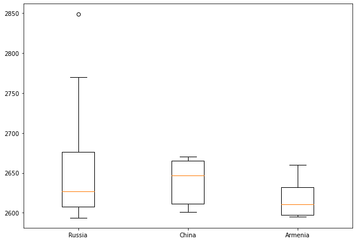
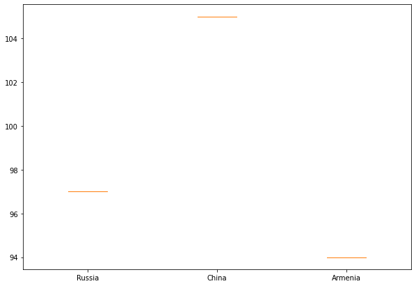
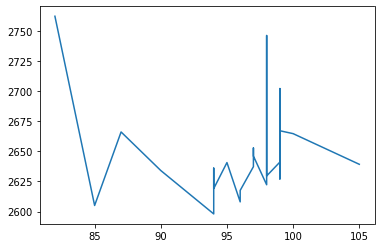
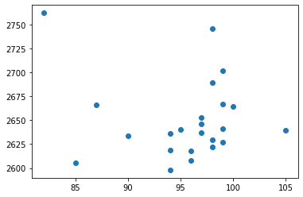

# Correlation-Between-IQ-And-Chess-Rating
Is there a relationship between Chess rating and IQ? To determine this, multiple dataset is gathered from 3 different sources, read into Jupyter Notebook, Transformed, loaded into a database, and Analyzed. All this is in the Jupyter Notebook file.

### Step 1 Reading data

We use `Country_abbreviations.csv, fide_historical.csv, IQ_by_country.csv` for our research
    url = "https://brainstats.com/en/average-iq"
    url2 = "https://laendercode.net/en/3-letter-list.html"

    html = get(url, headers=header).text
    html2 = get(url2,headers=header).text
    IQ_df = pd.read_html(html)[0]
    Country_df = pd.read_html(html2)[0]

    IQ_df.to_csv("Resources/IQ_by_country.csv")
    Country_df.to_csv("Resources/Country_abbreviations.csv")

### Step 2 Transforming data

We merged all data to one Pandas DataFrame with columns 
```
Country_name - full name of country
IQ Average   - the average iq of the country
Country      - the short code for each country
rank         - the fide rank of a chess player
name         - the full_name of a chess player
rating       - the fide rating of a chess player
birth year   - birth year of a chess player

```

    Chess_df = pd.read_csv("Resources/fide_historical.csv")
    Country_abb_df = pd.read_csv("Resources/Country_abbreviations.csv")
    Country_IQ_df = pd.read_csv("Resources/IQ_by_country.csv")
    IQ_by_country_df = pd.merge(Country_IQ_df,Country_abb_df,on = "Country")
    IQ_by_country_df.columns = [" ", "Rank", "Country_name", "IQ Average", "idx", "Country"]
    IQ_by_country_df = IQ_by_country_df[["Rank", "Country_name", "IQ Average", "Country"]]
    Chess_players_df = pd.merge(IQ_by_country_df, Chess_df, on = "Country")
    Chess_players_complete_df = Chess_players_df.drop(columns=["Rank","title","games","ranking_date"])
    Chess_players_complete_df.sort_values("rank")

# IQ_by_country_df.head()
# Chess_players_df.head()
Chess_players_complete_df.head()

### Step 3 clearing

I dropped null values when preparing data and sorted the columns.
    Chess_players_complete_df = Chess_players_df.drop(columns=["Rank","title","games","ranking_date"])
    Chess_players_complete_df.sort_values("rank")

### Step 3 Loading

We load the data to sql using python sqlalchemy library

    engine = sqlalchemy.create_engine('sqlite://', echo=False)
    Chess_players_complete_df.to_sql('Chess_db', con=engine)
    engine.execute("SELECT * FROM Chess_db").fetchall()

### Step 4 plotting

We choose the countries for which we have more players and for which we can find the average scores and analyze it.
Firstly we choose `Russia, China and Armenia` for researching.

    fig = plt.figure(figsize =(10, 7))
    ax = fig.add_subplot(111)

    ax.set_xticklabels(["Russia", "China", "Armenia"])
    ax.boxplot(data_rat)

We boxplot the rating of these countries and get this results.


Then we boxplot the iq of these countries and get this results.


from these 2 boxplots we can see that the average rating of Russian chess players is lower than China's players and higher than Armenian players.
Similarly, the average IQ for Russia is smaller than the average IQ for China and high than the average IQ of Armenia.
Now we can say that there exists some correlation between chess game and IQ.

When we plot the function where in x axis is iQ and int y axis is rating, we see that there is a correlation between them IQ and rating
Despite the outliers, and minimal number of players for each coutry, the correlation is visible in the scatter plot attached


